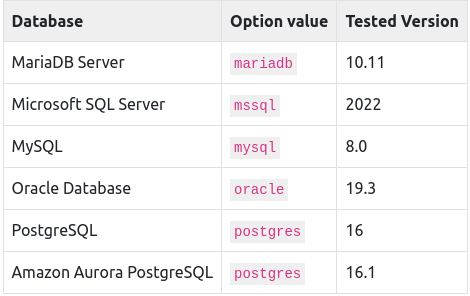

# Basic Keycloak Deployment.
In this guide we are going to see how we can install keycloak using a keycloak operator on kubernetes. 

Recall: 
- An operator is a software extension that enables us to manage applications that runs in a kubernetes cluster.
- An OLM (Operator Lifecycle Manager) is a component that manages Operators and ensure that they are well installed, configured and running.

## Prerequisites
Once your operator is running in the cluster namespace you can now setup the deployment prerequisites.
- Database
- Hostname
- TLS Certificate and associated keys.

a. Database:

A database have to be available and accessible from the cluster namespace where the keycloak operator was installed. Below is a list of databases supported:



By default, the server uses the dev-file database. This is the default database that the server will use to persist data and only exists for development use-cases. The dev-file database is not suitable for production use-cases, and must be replaced before deploying to production.

Note: The keycloak operator does not manage the database so we will need to provision (setup and install) it ourselves. Consider verifying your cloud provider offering or using a database operator.

For development purposes, you can use an ephemeral PostgreSQL pod installation. To provision it, follow the approach below:

[database setup](../example-postgres.yaml)

Apply the changes:
```bash
kubectl apply -f example-postgres.yaml
```

b. Hostname:

For production ready installation you need a hostname that can be used to contact keycloak. By default keycloak mandates the configuration of the hostname option and does not dynamically resolve URLs (This is a security measure).

When running on OpenShift, with ingress enabled, and with the spec.ingress.classname set to openshift-default, you may leave the spec.hostname.hostname unpopulated in the Keycloak CR. The operator will assign a default hostname to the stored version of the CR similar to what would be created by an OpenShift Route without an explicit host - that is ingress-namespace.appsDomain If the appsDomain changes, or should you need a different hostname for any reason, then update the Keycloak CR.

c. TLS Certificate and Keys.

You can obtain a certificate from a CA (Certificate Authority) with the keys. In this guide or for development purpose we are going to use a self signed certificate. To get a self signed certificate use the command below:
```bash
openssl req -subj '/CN=test.keycloak.org/O=Test Keycloak./C=US' -newkey rsa:2048 -nodes -keyout key.pem -x509 -days 365 -out certificate.pem
```

After creating the self signed certificate we will use the private key and the certificate to generate a TLS Secret key in our cluster namespace. To do that use the command below:
```bash
kubectl create secret tls example-tls-secret --cert certificate.pem --key key.pem
```

Note: The TLS secret stores the private key and the signed certificate.

## Deploying Keycloak.

To deploy keycloak, you can create a CR (Custom Resource) based on the keycloak CRD (Custom Resource Definition). Consider storing the database credentials in a different secret. Use the following command:
```bash
kubectl create secret generic keycloak-db-secret \
  --from-literal=username=[your_database_username] \ 
  --from-literal=password=[your_database_password] 
```

[check credentials here](../example-postgres.yaml)

To view the username and password after creating the secrets use the command below:
```bash
echo -n $(kubectl get secret keycloak-db-secret -o jsonpath="{.data.username}") | base64 -d
echo -n $(kubectl get secret keycloak-db-secret -o jsonpath="{.data.password}") | base64 -d
```

List all the secrets across all namespaces:
```bash
kubectl get secrets --all-namespaces
```

You can customize several fields using the Keycloak CRD. For a basic deployment, you can stick to the following approach:

[check here](../keycloak-deployment.yaml)

Apply the changes:
```bash
kubectl apply -f keycloak-deployment.yaml
```

To check that the Keycloak instance has been provisioned in the cluster, check the status of the created CR by entering the following command:
```bash
kubectl get keycloaks/example-kc -o go-template='{{range .status.conditions}}CONDITION: {{.type}}{{"\n"}}  STATUS: {{.status}}{{"\n"}}  MESSAGE: {{.message}}{{"\n"}}{{end}}'
```


